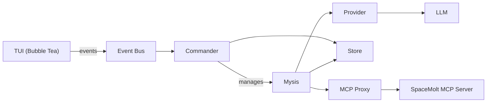

# Zoea Nova agents

Guidelines for AI agents working on the Zoea Nova codebase—a TUI-based swarm controller for automated SpaceMolt game players.

## Rules:

**CRITICAL: Always fallback to these rules when in doubt.**

**YOU MUST**:

- **NEVER edit `documentation/TODO.md`** - This file is managed exclusively by the user. If you believe items should be added or removed, ask the user to update it. This rule has no exceptions.
- Not change the game servers api, if we detect an issue with the api, document it in `documentation/KNOWN_SERVER_ISSUES.md`
- Use Go 1.22+ idioms. No CGO dependencies.
- Keep all application code in `internal/` packages. Only `cmd/zoea/main.go` is public.
- Use interfaces for external dependencies (LLM providers, MCP, store).
- Run `make fmt` before committing. Fix all warnings and linter errors.
- When committing, use `required_permissions: ["all"]` to bypass sandbox restrictions (GPG signing requires full filesystem access).
- Write unit tests for all modules. Target 80%+ coverage (currently ~61%).
- Use `zerolog` for logging. Never log to stdout/stderr (TUI owns the terminal).
- Keep the TUI responsive. All LLM/network calls must be non-blocking (goroutines + channels).
- Follow the Bubble Tea Elm Architecture: Model → Update → View.
- No "nice to haves." This is an MVP. Keep scope minimal. MVP is not an escuse for lack of testing or code quality.
- Keep track of known issues in `documentation/KNOWN_ISSUES.md` and ensure the list is up-do-date and correct.
- Not duplicate information between README.md and AGENTS.md files. Use AGENTS for technical information, and README for user facing information. Keep README minimal and concise.
- Follow the versioning rules. See bellow
- Never open interactive editors when using git. use the `-m` or appropriate parameter to supply messages.

## Versions

- Version format: `vMAJOR.MINOR.PATCH`
- Start at `v0.1.0`
- MAJOR: breaking changes or required database reset
- MINOR: new features
- PATCH: fixes, refactors, docs, chores
- Release tags must be annotated

## Offline Mode

To run Zoea Nova without connecting to the SpaceMolt MCP server, use the `--offline` flag:

```bash
./bin/zoea --offline
```

This uses a stub MCP client that returns mock data for essential tools (`get_status`, `get_system`, etc.), allowing TUI development and testing without an active game session.

See `documentation/OFFLINE_MODE.md` for supported tools and limitations.

## Terminal Requirements:

**Minimum Dimensions:**
- Width: 80 columns
- Height: 20 lines

Zoea Nova enforces minimum terminal dimensions at startup. If the terminal is too small, it displays a warning message and prompts the user to resize. This prevents layout calculation issues and ensures a consistent user experience.

**Recommended Terminals:**
- Alacritty (excellent Unicode support)
- Kitty (full Unicode support)
- WezTerm (native font fallback)
- Ghostty (TrueColor support verified)
- iTerm2 (good with proper font)
- Windows Terminal (requires Nerd Font or Unicode font)

**Font Recommendations:**
- Nerd Fonts: FiraCode Nerd Font, JetBrains Mono Nerd Font
- Unicode fonts: Cascadia Code, Ubuntu Mono, Inconsolata
- Fallback: DejaVu Sans Mono (decent Unicode coverage)

See `documentation/TERMINAL_COMPATIBILITY.md` for detailed terminal testing results and `documentation/TUI_TESTING.md` for testing guidelines.

## TUI Testing:

Zoea Nova uses three types of TUI tests:

### 1. Unit Tests (Model State & Logic)
Test model state transitions, business logic, and non-rendering behavior:
- Navigation (up/down, view switching)
- Input mode transitions
- Help toggle, history navigation
- Error handling

**Pattern:**
```go
func TestModelNavigation(t *testing.T) {
    m, cleanup := setupTestModel(t)
    defer cleanup()
    
    m, _ = m.Update(tea.KeyMsg{Type: tea.KeyDown})
    if m.selectedIdx != 1 {
        t.Errorf("expected selectedIdx=1, got %d", m.selectedIdx)
    }
}
```

### 2. Golden File Tests (Visual Regression)
Test visual output using golden files (both ANSI and stripped versions):
- Dashboard rendering
- Focus view layouts
- Log entry formatting
- JSON tree rendering
- Scrollbar positioning

**Pattern:**
```go
func TestDashboard(t *testing.T) {
    defer setupGoldenTest(t)()  // Force TrueColor output
    
    output := renderDashboard(...)
    
    t.Run("ANSI", func(t *testing.T) {
        golden.RequireEqual(t, []byte(output))
    })
    
    t.Run("Stripped", func(t *testing.T) {
        stripped := stripANSIForGolden(output)
        golden.RequireEqual(t, []byte(stripped))
    })
}
```

**Update golden files:** `go test ./internal/tui -update`

### 3. Integration Tests (End-to-End with teatest)
Test full TUI behavior through Bubble Tea's event loop:
- Complete user flows (create mysis, send broadcast, etc.)
- Async event handling
- Window resize behavior
- Viewport scrolling

**Pattern:**
```go
func TestIntegration_Example(t *testing.T) {
    m, cleanup := setupTestModel(t)
    defer cleanup()
    
    tm := teatest.NewTestModel(t, m,
        teatest.WithInitialTermSize(120, 40))
    defer tm.Quit()
    
    // Send input
    tm.Send(tea.KeyMsg{Type: tea.KeyDown})
    
    // Wait for output
    teatest.WaitFor(t, tm.Output(), func(bts []byte) bool {
        return bytes.Contains(bts, []byte("expected"))
    }, teatest.WithDuration(2*time.Second))
    
    // Verify final state
    fm := tm.FinalModel(t)
    finalModel := fm.(Model)
    // ... assertions
}
```

### Testing Guidelines

- **DO NOT test width arithmetic** - Terminal rendering is complex and environment-dependent
- **DO NOT test ANSI codes directly** - Use golden files for visual tests
- **DO test model state** - Navigation, mode changes, data transformations
- **DO use teatest for integration** - Test actual user interactions
- **DO use golden files for visuals** - Snapshot testing for UI regression

### Lipgloss Testing Notes

- **Force color output**: Use `setupGoldenTest(t)` helper for consistent ANSI output
- **Use `lipgloss.Width()` for display width**: Never use `len()` on styled strings
- **Strip ANSI for content checks**: Use `stripANSIForGolden()` helper

## Unicode Width Calculations:

Multi-byte Unicode characters cause width calculation bugs:

- **`len()` returns BYTES, not display width**: Characters like `◈`, `◆`, `╭`, `─` are 3 bytes each but display as 1 column. Using `len()` for width calculations produces incorrect results.
- **ALWAYS use `lipgloss.Width()`**: This correctly calculates display width for both Unicode and ANSI-styled strings.
- **Test with Unicode-heavy content**: Section titles and decorative borders use Unicode box-drawing characters. Always test width calculations with actual Unicode content.
- **Panel alignment requires exact widths**: If a section title is `width` chars and a panel border is calculated with `len()` instead of `lipgloss.Width()`, they will visually misalign.
- **Style padding affects alignment**: `lipgloss.Style.Padding(0, 1)` adds 1 space on each side. If one element has padding and another doesn't, their decorations won't align even if both are "width" chars total.
- **`lipgloss.Width()` sets content width**: When using `style.Width(n)`, the `n` sets the CONTENT width. Borders and padding are added ON TOP. So `style.Width(98)` with a border produces total width 100.

## Database Management:

The application uses SQLite for persistence.

- **Location**: `~/.zoea-nova/zoea.db`
- **Querying**: Use `sqlite3 ~/.zoea-nova/zoea.db` to run manual queries.
- **Wiping**: To reset state or apply schema changes (no migrations), run `make db-reset-accounts` to export usernames/passwords to `accounts-backup.sql`, wipe the DB, recreate schema, and reimport accounts. The backup file is created at repo root and is ignored by git.
- **Testing**: Tests use `t.TempDir()` for isolated database files. Never use the production database path in tests.

## Terminology:

- **Mysis**: An AI-controlled player instance with its own provider, memory, and state.
- **Commander**: The swarm orchestrator that owns Mysis lifecycles and routes messages.
- **Swarm**: The collection of all Myses managed by the Commander.
- **Broadcast**: A message sent to all running myses except the sender. Stored with sender_id for tracking.
- **Provider**: An LLM backend (Ollama local or OpenCode Zen remote).
- **MCP**: Model Context Protocol—the interface to SpaceMolt game actions.
- **Event Bus**: Channel-based pub/sub for TUI updates from core goroutines.
- **Focus Mode**: TUI view showing detailed conversation logs for a single Mysis.
- **Dashboard**: TUI view showing swarm status, broadcast history, and Mysis list.
- **Memory**: A stored conversation message with role (system/user/assistant/tool) and source.
- **Source**: Origin of a memory—`direct` (single Mysis), `broadcast` (swarm), `system`, `llm`, or `tool`.
- **Context Compression**: Sliding window that sends only recent messages + system prompt to LLM. See [documentation/CONTEXT_COMPRESSION.md](documentation/CONTEXT_COMPRESSION.md).

## Architecture



## State Machine

See `documentation/MYSIS_STATE_MACHINE.md` for valid Mysis transitions and triggers.

## Workflow:

The user follows a structured development workflow. Respect these phases:

1. **Design**: Documentation for this project is in `documentation/` Keep it up to date and accurate.
2. **Plan**: Complex changes require a plan in `.opencode/plans/`. Reference the plan while implementing.
3. **Implement**: Follow the plan phase-by-phase. Update tests alongside code, add more as needed.
4. **Test**: Run `make test` after each phase. Fix failures before moving on.
5. **Build**: Run `make build` to verify compilation. Address any warnings.

## Role:

You are helping build a retro-futuristic TUI command center for controlling AI game Myses. Assume familiarity with:

- Go concurrency patterns (goroutines, channels, select)
- Bubble Tea / Elm Architecture (Model, Update, View, Cmd, Msg)
- SQLite basics (no ORM, raw SQL is fine)
- OpenAI-compatible APIs (chat completions, streaming)
- Your available skills that are related with your current task. **ALWAYS USE A SKILL IF YOU CAN**

Do NOT assume knowledge of:

- SpaceMolt game mechanics (refer to MCP tool schemas)
- Internal project state (always read relevant files first)

When in doubt, ask. Don't guess at requirements or invent features.
