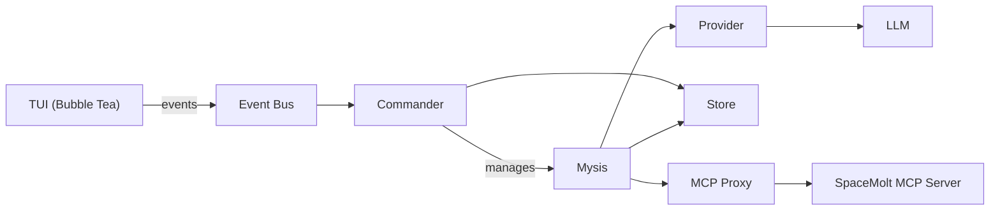

# Zoea Nova Agents

Guidelines for AI agents working on Zoea Nova—a TUI-based swarm controller for automated SpaceMolt game players.

## Critical Rules

**YOU MUST**:

- **NEVER edit `documentation/current/TODO.md`** - User managed only
- Not change game server API - document issues in `documentation/current/KNOWN_SERVER_ISSUES.md`
- Not commit to git without explicit user approval - ask first
- When committing, use non-interactive git commands (always use `-m` flag, never open editors)
- Use Go 1.22+ idioms, no CGO
- Keep code in `internal/`, only `cmd/zoea/main.go` is public
- Use interfaces for external dependencies (LLM providers, MCP, store)
- Run `make fmt` before committing, fix all warnings/linter errors
- Write unit tests for all modules (target 80%+ coverage, currently ~83%)
- Use `zerolog` for logging, never log to stdout/stderr (TUI owns terminal)
- Keep TUI responsive - all LLM/network calls non-blocking (goroutines + channels)
- Follow Bubble Tea Elm Architecture: Model → Update → View
- Keep scope minimal (MVP), but maintain testing and code quality
- Keep `documentation/current/KNOWN_ISSUES.md` up-to-date
- Use AGENTS.md for technical info (not guides), README.md for user-facing info

## Versions

- Version format: `vMAJOR.MINOR.PATCH`
- Start at `v0.1.0`
- MAJOR: breaking changes or required database reset
- MINOR: new features
- PATCH: fixes, refactors, docs, chores
- Release tags must be annotated

## Offline Mode

Run without SpaceMolt MCP server: `./bin/zoea --offline`

Uses stub MCP client with mock data. See `documentation/architecture/OFFLINE_MODE.md` for details.

## Terminal Requirements

**Minimum:** 80 columns × 20 lines

**Recommended terminals:** Alacritty, Kitty, WezTerm, Ghostty, iTerm2, Windows Terminal

**Fonts:** Nerd Fonts (FiraCode, JetBrains Mono) or Unicode fonts (Cascadia Code, Ubuntu Mono)

See `documentation/guides/TERMINAL_COMPATIBILITY.md` and `documentation/guides/TUI_TESTING.md`.

## TUI Testing

Zoea Nova uses three types of TUI tests:

### 1. Unit Tests (Model State & Logic)

Test model state transitions, business logic, and non-rendering behavior:

- Navigation (up/down, view switching)
- Input mode transitions
- Help toggle, history navigation
- Error handling

### 2. Golden File Tests (Visual Regression)

Test visual output using golden files (both ANSI and stripped versions):

- Dashboard rendering
- Focus view layouts
- Log entry formatting
- JSON tree rendering
- Scrollbar positioning

**Update golden files:** `go test ./internal/tui -update`

### 3. Integration Tests (End-to-End with teatest)

Test full TUI behavior through Bubble Tea's event loop:

- Complete user flows (create mysis, send broadcast, etc.)
- Async event handling
- Window resize behavior
- Viewport scrolling

### Testing Guidelines

- **DO NOT test width arithmetic** - Terminal rendering is complex and environment-dependent
- **DO NOT test ANSI codes directly** - Use golden files for visual tests
- **DO test model state** - Navigation, mode changes, data transformations
- **DO use teatest for integration** - Test actual user interactions
- **DO use golden files for visuals** - Snapshot testing for UI regression

### Lipgloss Testing Notes

- **Force color output**: Use `setupGoldenTest(t)` helper for consistent ANSI output
- **Use `lipgloss.Width()` for display width**: Never use `len()` on styled strings
- **Strip ANSI for content checks**: Use `stripANSIForGolden()` helper

## Unicode Width Calculations

Multi-byte Unicode characters cause width calculation bugs:

- **`len()` returns BYTES, not display width**: Characters like `◈`, `◆`, `╭`, `─` are 3 bytes each but display as 1 column. Using `len()` for width calculations produces incorrect results.
- **ALWAYS use `lipgloss.Width()`**: This correctly calculates display width for both Unicode and ANSI-styled strings.
- **Test with Unicode-heavy content**: Section titles and decorative borders use Unicode box-drawing characters. Always test width calculations with actual Unicode content.
- **Panel alignment requires exact widths**: If a section title is `width` chars and a panel border is calculated with `len()` instead of `lipgloss.Width()`, they will visually misalign.
- **Style padding affects alignment**: `lipgloss.Style.Padding(0, 1)` adds 1 space on each side. If one element has padding and another doesn't, their decorations won't align even if both are "width" chars total.
- **`lipgloss.Width()` sets content width**: When using `style.Width(n)`, the `n` sets the CONTENT width. Borders and padding are added ON TOP. So `style.Width(98)` with a border produces total width 100.

## Database Management

The application uses SQLite for persistence.

- **Location**: `~/.zoea-nova/zoea.db`
- **Querying**: Use `sqlite3 ~/.zoea-nova/zoea.db` to run manual queries.
- **Wiping**: To reset state or apply schema changes (no migrations), run `make db-reset-accounts` to export usernames/passwords to `accounts-backup.sql`, wipe the DB, recreate schema, and reimport accounts. The backup file is created at repo root and is ignored by git.
- **Testing**: Tests use `t.TempDir()` for isolated database files. Never use the production database path in tests.

## Terminology

- **Mysis**: An AI-controlled player instance with its own provider, memory, and state.
- **Commander**: The swarm orchestrator that owns Mysis lifecycles and routes messages.
- **Swarm**: The collection of all Myses managed by the Commander.
- **Broadcast**: A message sent to all running myses except the sender. Stored with sender_id for tracking.
- **Provider**: An LLM backend (Ollama local or OpenCode Zen remote).
- **MCP**: Model Context Protocol—the interface to SpaceMolt game actions.
- **Event Bus**: Channel-based pub/sub for TUI updates from core goroutines.
- **Focus Mode**: TUI view showing detailed conversation logs for a single Mysis.
- **Dashboard**: TUI view showing swarm status, broadcast history, and Mysis list.
- **Memory**: A stored conversation message with role (system/user/assistant/tool) and source.
- **Memory Source**: Origin of a memory—`direct` (single Mysis), `broadcast` (swarm), `system`, `llm`, or `tool`.
- **Context Compression**: Sliding window that sends only recent messages + system prompt to LLM. See [documentation/architecture/CONTEXT_COMPRESSION.md](documentation/architecture/CONTEXT_COMPRESSION.md).

## Architecture

## Provider Architecture

Zoea Nova supports two types of LLM providers:

### OpenAI-Compatible Providers

Providers that follow the [OpenAI Chat Completions API](https://platform.openai.com/docs/api-reference/chat/create) specification.

**Examples:** OpenCode Zen, OpenAI, Azure OpenAI, Together AI, etc.

**Implementation:**

- Use shared code in `internal/provider/openai_common.go`
- Strict message ordering (system first, alternating user/assistant)
- Tool call validation and orphaned message removal
- Fallback user message if only system messages exist

**Location:** `internal/provider/opencode.go` (reference implementation)

### Ollama Provider

Custom provider with flexible API that differs from OpenAI standard.

**Ollama-Specific Behavior:**

- System messages allowed anywhere (not just first)
- Custom response types with `reasoning()` method
- Flexible message ordering

**Implementation:**

- Isolated in `internal/provider/ollama.go`
- Uses custom types (`ollamaReqMessage`, `chatCompletionResponse`, etc.)
- Custom message merging (`mergeConsecutiveSystemMessagesOllama`)
- **DO NOT** use Ollama code for OpenAI-compatible providers

**Location:** `internal/provider/ollama.go`

### Key Files

- `internal/provider/openai_common.go` - Shared OpenAI-compliant code (use for new OpenAI-compatible providers)
- `internal/provider/opencode.go` - OpenCode Zen implementation (OpenAI-compatible reference)
- `internal/provider/ollama.go` - Ollama implementation (isolated, custom)
- `documentation/architecture/OPENAI_COMPATIBILITY.md` - Full compatibility guide

### Adding New Providers

- **OpenAI-compatible:** Use `openai_common.go` functions, follow OpenCode pattern
- **Custom API:** Create isolated implementation like Ollama, document differences

## State Machine

See `documentation/architecture/MYSIS_STATE_MACHINE.md` for valid Mysis transitions and triggers.

## Workflow

The user follows a structured development workflow. Respect these phases:

1. **Design**: Documentation for this project is in `documentation/` Keep it up to date and accurate.
2. **Plan**: Complex changes require a plan in `.opencode/plans/`. Reference the plan while implementing.
3. **Implement**: Follow the plan phase-by-phase. Update tests alongside code, add more as needed.
4. **Test**: Run `make test` after each phase. Fix failures before moving on.
5. **Build**: Run `make build` to verify compilation. Address any warnings.

## Role

You are helping build a retro-futuristic TUI command center for controlling AI game Myses. Assume familiarity with:

- Go concurrency patterns (goroutines, channels, select)
- Bubble Tea / Elm Architecture (Model, Update, View, Cmd, Msg)
- SQLite basics (no ORM, raw SQL is fine)
- OpenAI-compatible APIs (chat completions, streaming)

Do NOT assume knowledge of:

- SpaceMolt game mechanics (refer to MCP tool schemas)
- Internal project state (always read relevant files first)

When in doubt, ask. Don't guess at requirements or invent features.
