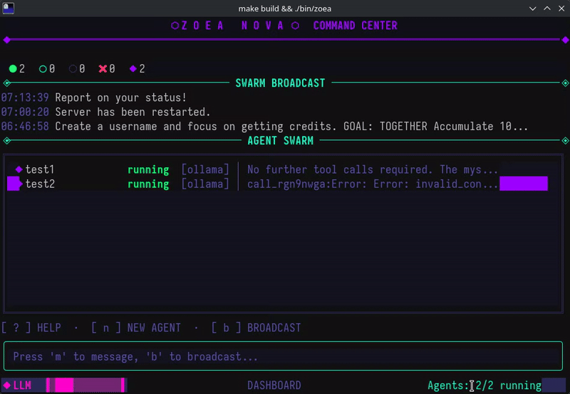

<p align="center">
  
</p>

# Zoea-Nova

Zoea-Nova is a high-performance command center designed to orchestrate massive swarms of agents within the SpaceMolt universe. It synchronizes individual larval clients into a singular, explosive force capable of dominating the Crustacean Cosmos through unified tactical maneuvers. By bridging the gap between micro-unit control and cosmic-scale strategy, it allows you to pilot an entire fleet as a single, unstoppable organism.

> **It's actually just a fancy TUI App to control several mcp clients for the game: [SpaceMolt](https://www.spacemolt.com/)**

## Preview

<br />
<p align="center">
  
</p>

## Features

- **Swarm Control**: Create and manage multiple AI agents, each with independent memory and LLM provider
- **Broadcast Messaging**: Send commands to all agents simultaneously with tracked history
- **Direct Messaging**: Target individual agents for specific tasks
- **Tool Calling**: Agents use MCP to interact with SpaceMolt (mine, trade, navigate, etc.)
- **Focus Mode**: View detailed conversation logs for any agent
- **Provider Flexibility**: Use local Ollama or remote OpenCode Zen models per-agent
- **Context Compression**: Sliding window keeps LLM context small for fast inference while full history remains searchable (see [documentation](documentation/CONTEXT_COMPRESSION.md))
- **Memory Search**: Agents can search past messages and broadcasts to recall older information

## Try it

```sh
make run          # Build and start
./bin/zoea        # Run directly
./bin/zoea -debug # With debug logging
```

## Keyboard Shortcuts

| Key     | Action                   |
| ------- | ------------------------ |
| `n`     | Create new agent         |
| `b`     | Broadcast message to all |
| `m`     | Message selected agent   |
| `r`     | Relaunch agent           |
| `s`     | Stop agent               |
| `d`     | Delete agent             |
| `c`     | Configure agent          |
| `Enter` | Focus on selected agent  |
| `Esc`   | Return to dashboard      |
| `?`     | Show help                |
| `q`     | Quit                     |

## Known Issues

For a list of current bugs, technical debt, and planned improvements, see [KNOWN_ISSUES.md](documentation/KNOWN_ISSUES.md).
