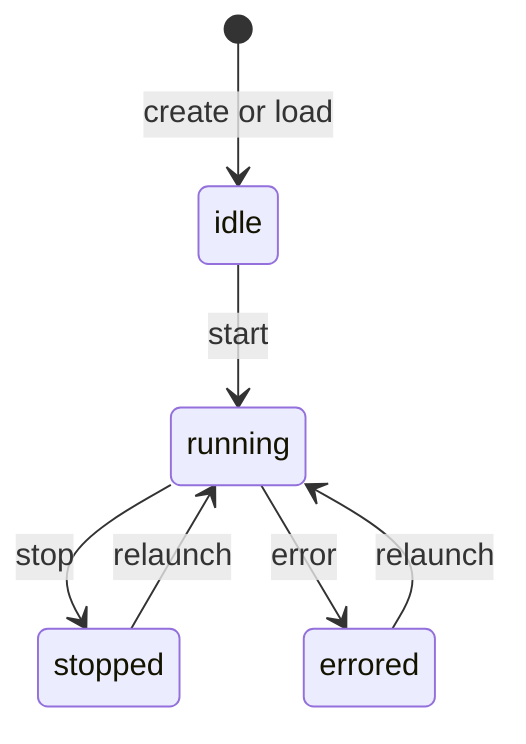

# Mysis State Machine

This document describes the valid Mysis lifecycle states and the transitions between them.

## States

- `idle`: Created or loaded but not running.
- `running`: Processing messages and tool calls.
- `stopped`: Explicitly stopped by user action.
- `errored`: Entered due to an error during execution or startup.

## Diagram

## Transition Triggers

### Create or Load

- When a Mysis is created in the store, its state is `idle`.
- When a Mysis is loaded at startup, the runtime instance starts in `idle` and must be explicitly started.

### Start (Relaunch)

- Triggered by `Commander.StartMysis` (TUI `r` key).
- Transitions to `running` from `idle`, `stopped`, or `errored`.
- If the store update fails during start, the Mysis enters `errored`.

### Stop

- Triggered by `Commander.StopMysis` (TUI `s` key).
- Valid only when currently `running`.
- Transitions to `stopped` and releases the current account.

### Error

- Triggered by `setErrorState` on execution failures.
- Transitions to `errored` and records `lastError`.

## Notes

- State updates are persisted via `store.UpdateMysisState`.
- `running` is the only state that accepts new messages.
