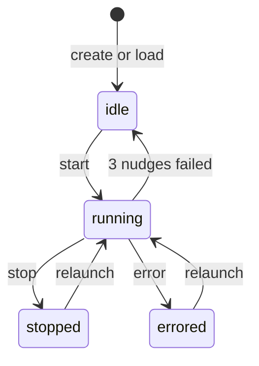

# Mysis State Machine

This document describes the valid Mysis lifecycle states and the transitions between them.

## States

- `idle`: Not running, but accepts messages. Messages are stored and processed when started. Set on creation and when a mysis fails 3 nudges; requires a commander message/broadcast or explicit start to resume processing.
- `running`: Active and eligible for nudges; waiting between loop iterations. Accepts messages.
- `stopped`: Explicitly stopped by user action. Rejects messages until relaunched.
- `errored`: Provider or MCP failures after retries; recorded as `lastError`. Rejects messages until relaunched.

## Activity (not a state)

- `thinking` is represented by `ActivityStateLLMCall` (not a MysisState).
- In-game activities (traveling, cooldown, etc.) are for context/TUI only and do not block nudges.

## Diagram

## Transition Triggers

### Create or Load

- When a Mysis is created in the store, its state is `idle`.
- When a Mysis is loaded at startup, the runtime instance starts in `idle` and must be explicitly started.

### Start (Relaunch)

- Triggered by `Commander.StartMysis` (TUI `r` key).
- Transitions to `running` from `idle`, `stopped`, or `errored`.
- If the store update fails during start, the Mysis remains unchanged and returns an error.

### Stop

- Triggered by `Commander.StopMysis` (TUI `s` key).
- Valid only when currently `running`.
- Transitions to `stopped` and releases the current account.

### Error

 - Triggered by `setErrorState` on execution failures (provider or MCP after retries).
 - Transitions to `errored` and records `lastError`.

### Idle (Nudge Breaker)

- Triggered after 3 failed nudges with no progress.
- Transitions to `idle` and signals that manual attention is needed.

## Message Acceptance

Messages can be sent to Myses in `idle` and `running` states:

- **`idle`**: Accepts messages. Messages are stored and will be processed when the Mysis is started.
- **`running`**: Accepts messages. Messages are processed immediately.
- **`stopped`**: Rejects messages with error "mysis stopped - press 'r' to relaunch"
- **`errored`**: Rejects messages with error "mysis errored - press 'r' to relaunch"

User-initiated stop (`stopped` state) and error conditions (`errored` state) require explicit relaunch before messages can be sent.

## Notes

- State updates are persisted via `store.UpdateMysisState`.
- Messages are accepted in `idle` and `running` states; rejected in `stopped` and `errored` states.
