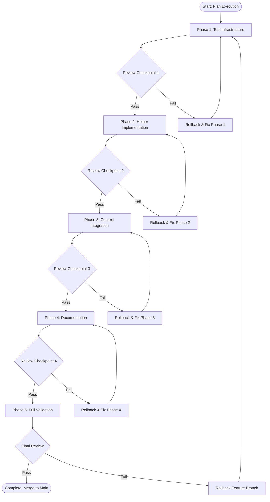
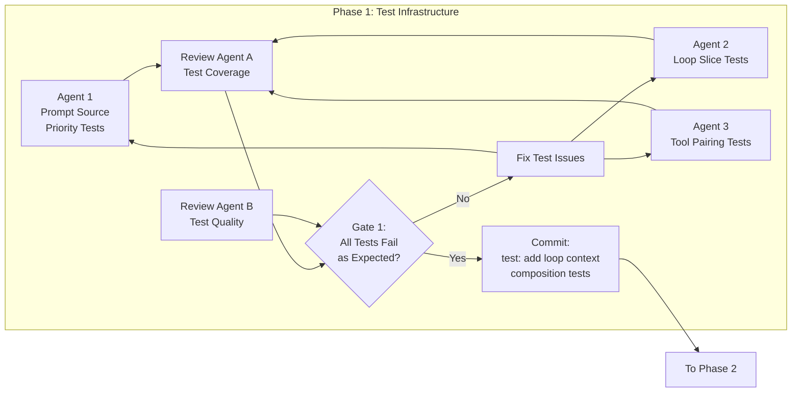
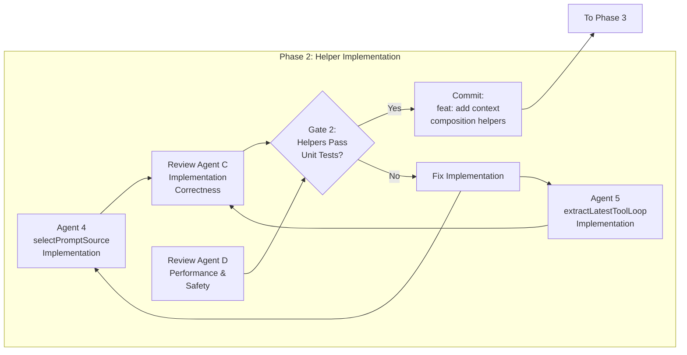
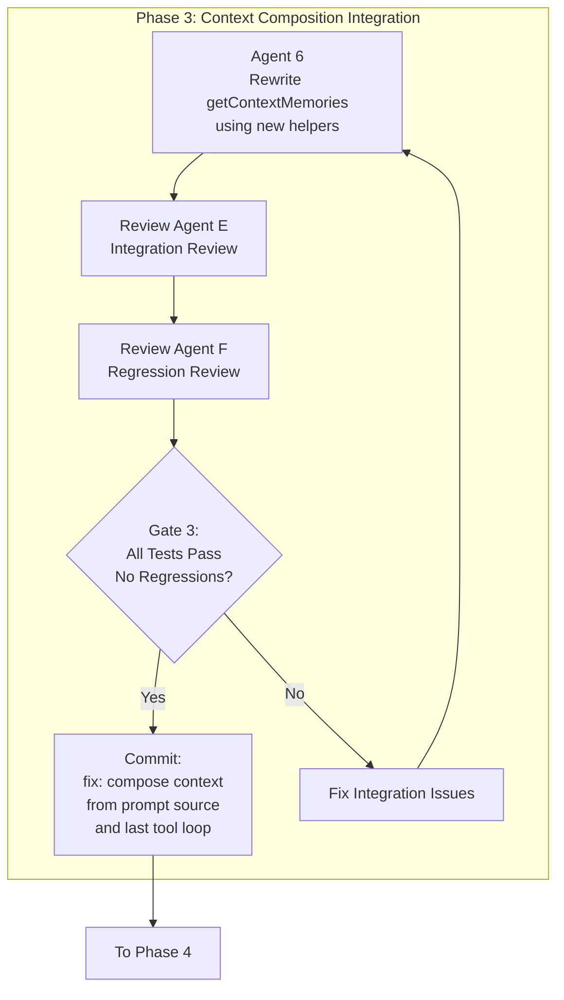
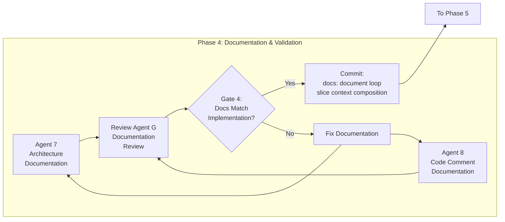
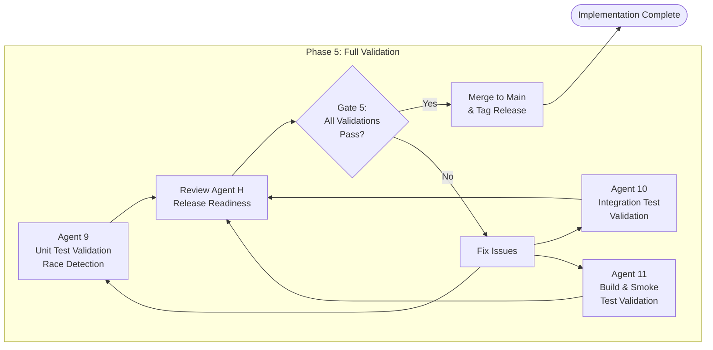
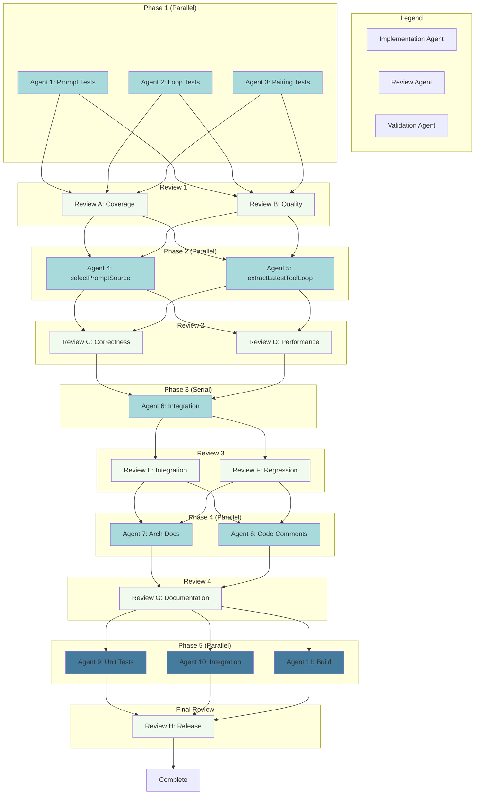
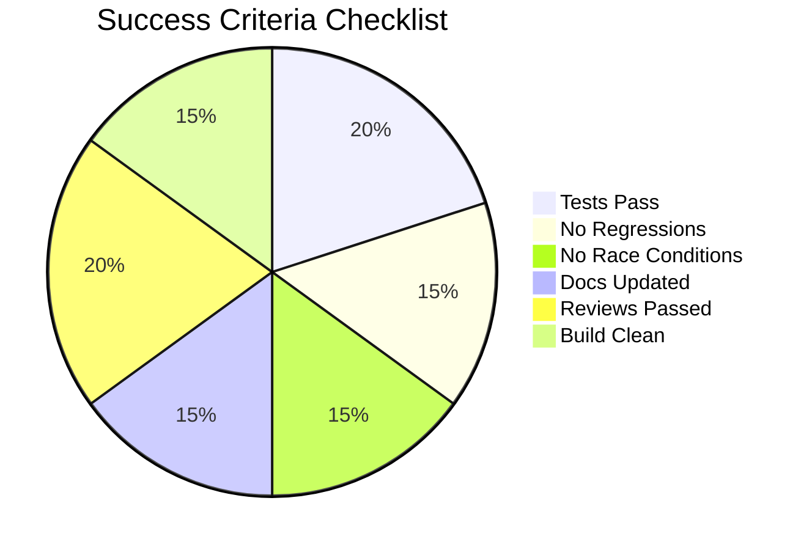

# Loop Context Composition - Parallel Workflow Diagram

## Overall Workflow



## Phase 1: Test Infrastructure (3 Parallel Agents)



## Phase 2: Helper Implementation (2 Parallel Agents)



## Phase 3: Context Integration (1 Serial Agent)



## Phase 4: Documentation (2 Parallel Agents)



## Phase 5: Full Validation (3 Parallel Agents)



## Agent Dependency Graph



## Timing Analysis

```mermaid
gantt
    title Loop Context Composition - Execution Timeline
    dateFormat X
    axisFormat %S
    
    section Phase 1
    Agent 1: Prompt Tests           :a1, 0, 10
    Agent 2: Loop Tests             :a2, 0, 10
    Agent 3: Pairing Tests          :a3, 0, 10
    Review 1: Coverage & Quality    :r1, 10, 12
    Gate 1: Decision                :milestone, g1, 12, 0
    
    section Phase 2
    Agent 4: selectPromptSource     :a4, 12, 22
    Agent 5: extractLatestToolLoop  :a5, 12, 22
    Review 2: Correctness & Perf    :r2, 22, 24
    Gate 2: Decision                :milestone, g2, 24, 0
    
    section Phase 3
    Agent 6: Integration            :a6, 24, 44
    Review 3: Integration & Regression :r3, 44, 46
    Gate 3: Decision                :milestone, g3, 46, 0
    
    section Phase 4
    Agent 7: Arch Docs              :a7, 46, 56
    Agent 8: Code Comments          :a8, 46, 56
    Review 4: Documentation         :r4, 56, 58
    Gate 4: Decision                :milestone, g4, 58, 0
    
    section Phase 5
    Agent 9: Unit Validation        :a9, 58, 68
    Agent 10: Integration Validation :a10, 58, 68
    Agent 11: Build Validation      :a11, 58, 68
    Final Review: Release Readiness :r5, 68, 70
    Gate 5: Decision                :milestone, g5, 70, 0
```

**Total Time:** 70 time units (6T execution + 5 reviews)
**Sequential Equivalent:** 90 time units (8T + 5 reviews)
**Speedup:** 22% faster with parallelization

## Critical Path

```mermaid
flowchart LR
    Start --> P1[Phase 1: Tests<br/>10 units]
    P1 --> R1[Review 1<br/>2 units]
    R1 --> P2[Phase 2: Helpers<br/>10 units]
    P2 --> R2[Review 2<br/>2 units]
    R2 --> P3[Phase 3: Integration<br/>20 units]
    P3 --> R3[Review 3<br/>2 units]
    R3 --> P4[Phase 4: Docs<br/>10 units]
    P4 --> R4[Review 4<br/>2 units]
    R4 --> P5[Phase 5: Validation<br/>10 units]
    P5 --> R5[Final Review<br/>2 units]
    R5 --> End[Complete]
    
    style P3 fill:#e63946
    style R3 fill:#e63946
```



**Critical Path:** Phase 3 (Integration) - longest serial task at 20 units

## Success Metrics



---

## Usage

This workflow document should be used alongside:
- **Plan:** [2026-02-07-loop-context-composition.md](2026-02-07-loop-context-composition.md)
- **Workflow:** [2026-02-07-loop-context-parallel-workflow.md](2026-02-07-loop-context-parallel-workflow.md)

Agents should reference the appropriate phase section and follow the gate criteria before proceeding to the next phase.
