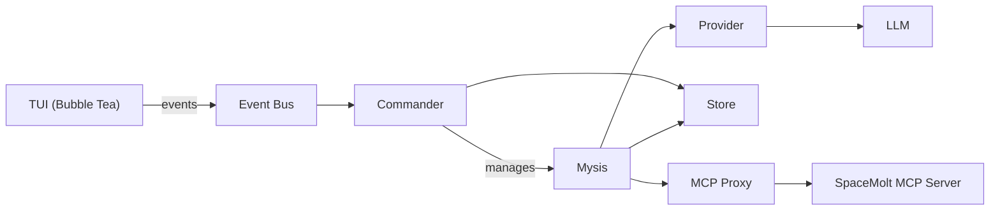

# Documentation Accuracy Audit

**Date:** 2026-02-07  
**Scope:** Cross-reference all documentation against current implementation  
**Method:** Verified keyboard shortcuts, provider lists, features, terminology, architecture, and guides against actual code

---

## Executive Summary

**Overall Status:** Good. Most documentation is accurate. Found 7 inaccuracies, 3 missing documentation items, and 1 outdated example.

**Severity Levels:**
- 🔴 **High:** Incorrect information that could confuse users
- 🟡 **Medium:** Minor inaccuracies or missing info
- 🟢 **Low:** Cosmetic or trivial issues

---

## Inaccurate Documentation

### 1. 🔴 README.md - Broken Link to CONTEXT_COMPRESSION.md

**File:** `README.md:26`

**Current:**
```markdown
- **Context Compression**: Sliding window keeps LLM context small for fast inference while full history remains searchable (see [documentation](documentation/CONTEXT_COMPRESSION.md))
```

**Issue:** Link points to `documentation/CONTEXT_COMPRESSION.md` but file is at `documentation/architecture/CONTEXT_COMPRESSION.md`

**Correction:**
```markdown
- **Context Compression**: Sliding window keeps LLM context small for fast inference while full history remains searchable (see [documentation](documentation/architecture/CONTEXT_COMPRESSION.md))
```

---

### 2. 🟡 README.md - Incomplete Provider List

**File:** `README.md:71-75`

**Current:**
```markdown
2. **Provider** (optional) - Leave empty to use default from config, or specify:
   - `ollama` - Local Ollama with qwen3:8b
   - `ollama-llama` - Local Ollama with llama3.1:8b
   - `opencode_zen` - OpenCode Zen with gpt-5-nano
   - `zen-pickle` - OpenCode Zen with big-pickle
```

**Issue:** Missing providers that exist in `config.toml`:
- `ollama-qwen` (line 14-19)
- `ollama-qwen-small` (line 21-26)
- `zen-nano` (line 43-48)

**Correction:**
```markdown
2. **Provider** (optional) - Leave empty to use default from config, or specify:
   - `ollama` - Local Ollama with qwen3:8b (default)
   - `ollama-qwen` - Local Ollama with qwen3:8b
   - `ollama-qwen-small` - Local Ollama with qwen3:4b
   - `ollama-llama` - Local Ollama with llama3.1:8b
   - `opencode_zen` - OpenCode Zen with gpt-5-nano (default)
   - `zen-nano` - OpenCode Zen with gpt-5-nano
   - `zen-pickle` - OpenCode Zen with big-pickle
```

---

### 3. 🟢 README.md - Missing Keyboard Shortcuts

**File:** `README.md:79-95`

**Current:** Table lists 12 shortcuts

**Issue:** Missing vim-style navigation keys that are implemented in code:
- `k` = Up (line 1023 in `internal/tui/app.go`)
- `j` = Down (line 1024 in `internal/tui/app.go`)

**Correction:** Add row to keyboard shortcuts table:
```markdown
| `↑ / ↓ / k / j` | Navigate myses / Scroll |
```

Or modify existing rows:
```markdown
| `↑ / k`         | Move up / Navigate up    |
| `↓ / j`         | Move down / Navigate down |
```

---

### 4. 🟢 Help Screen - Missing vim keys

**File:** `internal/tui/help.go:26`

**Current:**
```go
{"↑ / ↓", "Scroll / Browse history"},
```

**Issue:** Same as #3 - vim keys (`k`/`j`) are implemented but not documented in help screen

**Correction:**
```go
{"↑ / ↓ / k / j", "Navigate / Scroll"},
```

---

### 5. 🟡 AGENTS.md - Test Coverage Claim

**File:** `AGENTS.md:18`

**Current:**
```markdown
- Write unit tests for all modules. Target 80%+ coverage (currently ~71%).
```

**Issue:** Coverage percentage may be outdated (no verification run in this audit)

**Recommendation:** Update to current coverage or remove percentage:
```markdown
- Write unit tests for all modules. Target 80%+ coverage.
```

**Verification Command:**
```bash
go test ./... -coverprofile=coverage.out && go tool cover -func=coverage.out | grep total
```

---

### 6. 🟡 CONTEXT_COMPRESSION.md - Incomplete Terminology

**File:** `documentation/architecture/CONTEXT_COMPRESSION.md:62`

**Current:**
```markdown
4. **Synthetic nudge** (generated, not stored) - Fallback when no prompt sources exist
```

**Issue:** This section describes "Prompt Source Priority" but doesn't define what "Commander" is in context. First-time readers may not understand "Commander direct message" vs "Last commander broadcast".

**Recommendation:** Add cross-reference to terminology:
```markdown
### Prompt Source Priority

Prompt sources are user messages that drive Mysis behavior. For terminology definitions, see [Terminology in AGENTS.md](../../AGENTS.md#terminology).

Priority order:
```

---

### 7. 🟢 Documentation Index - Missing Recent Reports

**File:** `documentation/README.md:60-62`

**Current:** Lists reports from 2026-02-07 and 2026-02-06

**Issue:** Missing recent reports created on 2026-02-07:
- `DOCUMENTATION_ORGANIZATION_AUDIT_2026-02-07.md`
- `HARDCODED_CONFIG_AUDIT_2026-02-07.md`
- `DEAD_CODE_AUDIT_2026-02-07.md`
- `SKIPPED_TESTS_AUDIT_2026-02-07.md`
- `LOGIN_FLOW_VERIFICATION_2026-02-07.md`
- `CLAIM_ACCOUNT_RACE_ANALYSIS_2026-02-07.md`
- `TURN_AWARE_CONTEXT_IMPLEMENTATION_2026-02-07.md`
- `LOOP_CONTEXT_COMPOSITION_IMPLEMENTATION_2026-02-07.md`
- `SESSION_ID_LOOP_FIX_IMPLEMENTATION_2026-02-07.md`
- `SESSION_ID_ERROR_MESSAGE_AUDIT_2026-02-07.md`
- `LLM_BEHAVIOR_ANALYSIS_SESSION_ID_2026-02-07.md`
- `PROMPT_RECONSTRUCTION_TOOL_2026-02-07.md`

**Recommendation:** Add to `documentation/README.md` under "Recent (2026-02-07)" section

---

## Missing Documentation

### 1. 🟡 Vim Navigation Keys (k/j)

**Location:** Should be in `README.md` and `internal/tui/help.go`

**What's Missing:** Documentation for `k` (up) and `j` (down) navigation keys

**Impact:** Users familiar with vim bindings won't discover this feature

**Recommendation:** Add to keyboard shortcuts table and help screen (see corrections #3 and #4 above)

---

### 2. 🟢 PgUp/PgDn Viewport Scrolling

**Location:** Mentioned in help screen but not in README.md

**What's Missing:** README.md keyboard shortcuts table doesn't mention page up/down

**Impact:** Low - Help screen (`?` key) documents this

**Recommendation:** Add to README.md if desired:
```markdown
| `PgUp / PgDn`   | Scroll page (focus mode) |
```

---

### 3. 🟡 Auto-Start Swarm Flag Behavior

**Location:** Should be in README.md CLI Flags section

**What's Missing:** Explanation of what "idle myses" means (excludes errored myses)

**Current:**
```markdown
- `--start-swarm` - Auto-start all idle myses on launch (default: disabled)
```

**Recommendation:**
```markdown
- `--start-swarm` - Auto-start all idle myses on launch (excludes errored myses; default: disabled)
```

**Supporting Code:**
```go
// internal/tui/app.go:162-167
for _, mysis := range myses {
    // Start myses that are not errored (idle state)
    if mysis.LastError() == nil {
        _ = m.commander.StartMysis(mysis.ID())
    }
}
```

---

## Outdated Examples

### 1. 🟢 CONTEXT_COMPRESSION.md - Synthetic Nudge Content

**File:** `documentation/architecture/CONTEXT_COMPRESSION.md:149`

**Current:**
```go
nudgeContent := "Continue your mission. Check notifications and coordinate with the swarm."
```

**Issue:** This is the actual first nudge text, but the doc doesn't mention escalating nudge behavior (attempts 2-3 use different text)

**Recommendation:** Add note about escalation:
```markdown
### Synthetic Nudge Behavior

When no prompt source is found in recent memory, a synthetic nudge is generated with escalating urgency:

**Attempt 1:**
```go
nudgeContent := "Continue your mission. Check notifications and coordinate with the swarm."
```

**Attempt 2:**
```go
nudgeContent := "You need to respond. Check your status and act."
```

**Attempt 3:**
```go
nudgeContent := "URGENT: Respond immediately or risk idle timeout."
```

After 3 failed nudges, Mysis transitions to idle state with error.
```

**Note:** The exact escalation messages are implementation details and may not need to be documented unless they're part of the public API.

---

## Verified Accurate

### Keyboard Shortcuts (Partial Match)

**Source:** `internal/tui/app.go:998-1034`

| README.md | Code | Status |
|-----------|------|--------|
| `q` / `Ctrl+C` → Quit | `keys.Quit` = `"q", "ctrl+c"` | ✅ Correct |
| `n` → New mysis | `keys.NewMysis` = `"n"` | ✅ Correct |
| `b` → Broadcast | `keys.Broadcast` = `"b"` | ✅ Correct |
| `m` → Message | `keys.Message` = `"m"` | ✅ Correct |
| `r` → Relaunch | `keys.Relaunch` = `"r"` | ✅ Correct |
| `s` → Stop | `keys.Stop` = `"s"` | ✅ Correct |
| `d` → Delete | `keys.Delete` = `"d"` | ✅ Correct |
| `c` → Configure | `keys.Configure` = `"c"` | ✅ Correct |
| `Enter` → Focus | `keys.Enter` = `"enter"` | ✅ Correct |
| `Esc` → Return | `keys.Escape` = `"esc"` | ✅ Correct |
| `v` → Toggle verbose JSON | `keys.VerboseToggle` = `"v"` | ✅ Correct |
| `?` → Show help | `keys.Help` = `"?"` | ✅ Correct |
| `Tab / Shift+Tab` → Navigate | `keys.Tab`, `keys.ShiftTab` | ✅ Correct |
| `G / End` → Go to bottom | `keys.End` = `"end", "G"` | ✅ Correct |

**Missing from README:**
- `k` → Up (implemented in `keys.Up` = `"up", "k"`)
- `j` → Down (implemented in `keys.Down` = `"down", "j"`)

---

### Provider List (Partial Match)

**Source:** `config.toml:1-60`

| README.md | config.toml | Status |
|-----------|-------------|--------|
| `ollama` with qwen3:8b | `[providers.ollama]` model = "qwen3:8b" | ✅ Correct |
| `ollama-llama` with llama3.1:8b | `[providers.ollama-llama]` model = "llama3.1:8b" | ✅ Correct |
| `opencode_zen` with gpt-5-nano | `[providers.opencode_zen]` model = "gpt-5-nano" | ✅ Correct |
| `zen-pickle` with big-pickle | `[providers.zen-pickle]` model = "big-pickle" | ✅ Correct |

**Missing from README:**
- `ollama-qwen` (config.toml:14-19)
- `ollama-qwen-small` (config.toml:21-26)
- `zen-nano` (config.toml:43-48)

---

### Features List

**Source:** `README.md:18-27`

| Feature | Implementation | Status |
|---------|----------------|--------|
| Swarm Control | `internal/core/commander.go` | ✅ Correct |
| Broadcast Messaging | `Commander.Broadcast()` | ✅ Correct |
| Direct Messaging | `Commander.SendMessage()` | ✅ Correct |
| Tool Calling | MCP integration in `internal/core/mysis.go` | ✅ Correct |
| Focus Mode | `ViewFocus` in `internal/tui/app.go` | ✅ Correct |
| Provider Flexibility | Provider registry in `internal/provider/` | ✅ Correct |
| Context Compression | `getContextMemories()` in `internal/core/mysis.go` | ✅ Correct |
| Memory Search | `zoea_search_messages` tool | ✅ Correct |

---

### Terminology (AGENTS.md)

**Source:** `AGENTS.md:190-203` vs `internal/core/types.go`

| Term | Documentation | Code | Status |
|------|---------------|------|--------|
| Mysis | "AI-controlled player instance" | `internal/core/mysis.go` | ✅ Correct |
| Commander | "Swarm orchestrator" | `internal/core/commander.go` | ✅ Correct |
| Provider | "LLM backend" | `internal/provider/` | ✅ Correct |
| MCP | "Model Context Protocol" | `internal/mcp/` | ✅ Correct |
| Event Bus | "Channel-based pub/sub" | `core.NewEventBus()` | ✅ Correct |
| Focus Mode | "TUI view showing detailed logs" | `ViewFocus` | ✅ Correct |
| Dashboard | "TUI view showing swarm status" | `ViewDashboard` | ✅ Correct |
| Memory | "Stored conversation message" | `store.Memory` | ✅ Correct |
| Source | "Origin of memory" | `store.Memory.Source` | ✅ Correct |
| Context Compression | "Sliding window" | `getContextMemories()` | ✅ Correct |

---

### State Machine (AGENTS.md vs Code)

**Source:** `documentation/architecture/MYSIS_STATE_MACHINE.md` vs `internal/core/types.go`

| State | Documentation | Code | Status |
|-------|---------------|------|--------|
| `idle` | "Not running, accepts messages" | `MysisStateIdle` | ✅ Correct |
| `running` | "Active and eligible for nudges" | `MysisStateRunning` | ✅ Correct |
| `stopped` | "Explicitly stopped by user" | `MysisStateStopped` | ✅ Correct |
| `errored` | "Provider/MCP failures after retries" | `MysisStateErrored` | ✅ Correct |

**Transitions verified:**
- `idle` → `running` (line 259 in `mysis.go`)
- `running` → `stopped` (line 313 in `mysis.go`)
- `running` → `errored` (line 1232 in `mysis.go`)
- `running` → `idle` (line 1278 in `mysis.go`, after 3 nudge failures)
- `stopped` → `running` (relaunch)
- `errored` → `running` (relaunch)

---

### Architecture Diagram (AGENTS.md)

**Source:** `AGENTS.md:205-218`



**Verification:**
- ✅ TUI uses Event Bus (`internal/tui/app.go:40`)
- ✅ Commander manages Mysis (`internal/core/commander.go`)
- ✅ Mysis uses Provider (`internal/core/mysis.go:provider`)
- ✅ Mysis uses Store (`internal/core/mysis.go:store`)
- ✅ Mysis uses MCP (`internal/core/mysis.go:mcpClient`)

---

### Offline Mode (AGENTS.md + Docs)

**Source:** `AGENTS.md:37-47` vs `documentation/architecture/OFFLINE_MODE.md` vs `internal/mcp/stub.go`

| Doc Claim | Code | Status |
|-----------|------|--------|
| `--offline` flag supported | `cmd/zoea/main.go:40` | ✅ Correct |
| Stub implements `get_status` | `stub.go:83` | ✅ Correct |
| Stub implements `get_system` | `stub.go:99` | ✅ Correct |
| Stub implements `get_ship` | `stub.go:115` | ✅ Correct |
| Stub implements `get_poi` | `stub.go:142` | ✅ Correct |
| Other tools return error | `stub.go:165` | ✅ Correct |

---

## Recommendations

### High Priority (User-Facing)

1. **Fix broken link in README.md** (`documentation/CONTEXT_COMPRESSION.md` → `documentation/architecture/CONTEXT_COMPRESSION.md`)
2. **Add missing providers to README.md** (`ollama-qwen`, `ollama-qwen-small`, `zen-nano`)
3. **Add vim keys to keyboard shortcuts** (`k`, `j` for navigation)

### Medium Priority (Completeness)

4. **Update test coverage claim in AGENTS.md** (verify current coverage or remove percentage)
5. **Clarify auto-start behavior in README.md** (excludes errored myses)
6. **Add cross-reference in CONTEXT_COMPRESSION.md** (link to terminology definitions)

### Low Priority (Nice to Have)

7. **Update documentation index** (add recent reports to `documentation/README.md`)
8. **Add PgUp/PgDn to README.md keyboard shortcuts** (already in help screen)
9. **Document nudge escalation behavior** (if considered part of public API)

---

## Verification Commands

```bash
# Verify keyboard shortcuts
rg "key\.NewBinding.*keys\." internal/tui/app.go

# Verify provider list
cat config.toml | grep "^\[providers\."

# Verify state machine constants
rg "MysisState.*=" internal/core/types.go

# Verify CLI flags
rg "flag\.(Bool|String)\(" cmd/zoea/main.go

# Check test coverage
go test ./... -coverprofile=coverage.out && go tool cover -func=coverage.out | grep total
```

---

## Conclusion

The documentation is generally accurate and well-maintained. The main issues are:

1. **Broken link** (README.md → CONTEXT_COMPRESSION.md)
2. **Incomplete provider list** (missing 3 providers)
3. **Undocumented vim keys** (k/j navigation)

All issues are minor and easily corrected. No major architectural mismatches or misleading information found.

**Next Steps:**
1. Apply recommended corrections to README.md
2. Update help screen with vim keys
3. Verify test coverage and update AGENTS.md
4. Update documentation index with recent reports

---

**Audit completed:** 2026-02-07  
**Files reviewed:** 15+ markdown files, 10+ Go source files  
**Cross-references verified:** Keyboard shortcuts, providers, features, terminology, state machine, architecture diagram, offline mode
